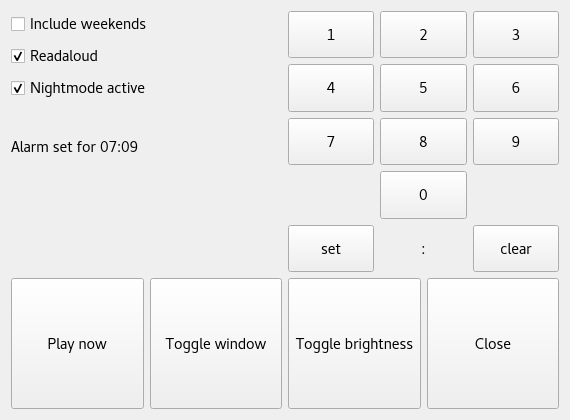

# Alarmpi

A clock radio for a Raspberry Pi with customizable alarm.
```
Good afternoon, it's Wednesday September twelfth. The time is 07:29 PM.

Weather for today is Mostly Cloudy becoming rainy. It is currently 16 degrees  with a fresh breeze. The high for today is 17 and the low at 11 degrees. The sun rises at 06:43 AM and sets at 07:50 PM.

And now, The latest stories from the World section of the BBC News.

EU parliament votes to punish Hungary over 'breaches' of core values.
The European Parliament votes to punish Hungary for allegedly flouting EU values and the rule of law.

Hurricane Florence: Mass evacuation from 'storm of a lifetime'.
South Carolina authorities turn four motorways into one-way routes away from the coast.

Morocco bans forced marriage and sexual violence.
The new law criminalises sexual harassment and imposes tougher penalties on perpetrators.

Sri Lanka to ban Hindu animal sacrifice.
The ritual killing of animals such as goats could soon be outlawed at Sri Lanka's Hindu temples.


Thats all for now. Have a nice day.
```
[Play on SoundCloud](https://soundcloud.com/lajanki/pialarm_sample)


This is a fork of skiwithpete's alarmpi project: https://github.com/skiwithpete/alarmpi. After seeing it on [YouTube](https://youtu.be/julETnOLkaU), I thought it was awsome and knew I wanted to use it to replace my old night table clock radio.


### Main Features
 * A spoken greeting based on time of day
 * Reads the day's weather using Yahoo Weather
 * Reads latest news from BBC World RSS feed
 * Streams internet radio streams using `mplayer`
 * Alarm scheduling via cron
 * GUI with current time

The GUI for the clock is rather primitive due to hardware limitations: I build this project to run on a Raspberry Pi together with the official touch screen display as the only input device. Since Raspbian is not a touch screen OS, its support is limited to emulating mouse clicks. The alarm is therefore set using a binary based toggles for hour and minute.





#### Changes to the original project:
 * Ported to Python 3 (Python 2 is unsupported)
 * Changed naming conventions to be more PEP 8 compliant
 * Added option to stream an internet radio station
 * Removed features not applicable to my use case
 * Reorganized file structure
 * Changed available text-to-speech engines, see `config_readme.md`
 * Changed audio processing to use in-memory objects, thus removing the need to setup a ramdrive
 * Added unit tests


### Setup
 1. First, install required system packages with

  ```apt install ffmpeg festival mplayer portaudio19-dev python-all-dev```

  These include the Festival text-to-speech engine, the command line movie player mplayer and audio libraries enabling playback of mp3 files directly in Python.

 2. Next, install required Python packages:

  ```pip install -r requirements.txt```

  Or better yet, use a virtualenv

  ```
  python3 -m virtualenv env
  source env/bin/activate
  pip install -r requirements.txt
  ```

 3. If you haven't done so already, initialize crontab with

 ```crontab -e```

  and follow the instructions.

   * Since this script uses cron to schedule the alarm and hende modifies crontab. If a crontab already exists, you may therefore want to create a backup with `crontab -l > cron.backup` before running the script. It can be restored with `crontab cron.backup`.  

 4. Optionally, run unit tests with

  ```python -m unittest -v tests/test*.py```


### Usage
Run the script either with
```
python main.py [path/to/configuration/file]
```
or
```
python sound_the_alarm.py [path/to/configuration/file]
```

The first form open the GUI for displaying current time and scheduling the alarm. In a headless Raspberry Pi environment this will fail since Tkinter cannot be imported. Instead, use the second form to play the alarm directly and add a cron entry manually to schedule it.

In either case, scheduling an alarm is done by adding a new cron entry to `sound_the_alarm.py`. This means that when scheduled, the alarm will play regardless of whether the GUI is running or not!

The optional argument in both forms is a path to a configuration file for customizing the alarm, see `config_readme.md` for instructions. By default `alarm.config` will be used.

Note that while the alarm time can be set from the GUI, the date cannot. The alarm is hard coded to occur every monday to friday at the specified time.


The interface to `sound_the_alarm.py` is:
```
positional arguments:
  config         path to the config file

optional arguments:
  -h, --help     show this help message and exit
  --init-config  re-create the default configuration file alarm.config.
                 Overwrites existing file.
```
