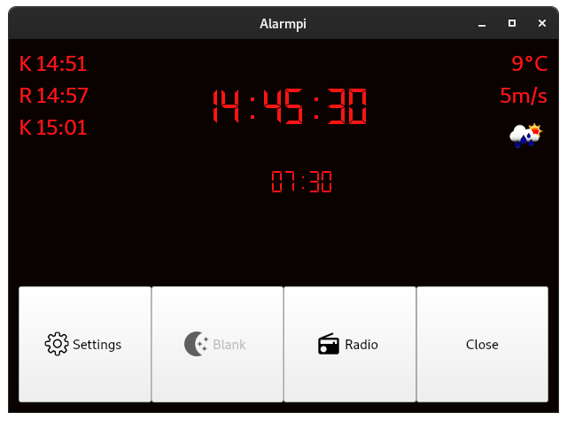
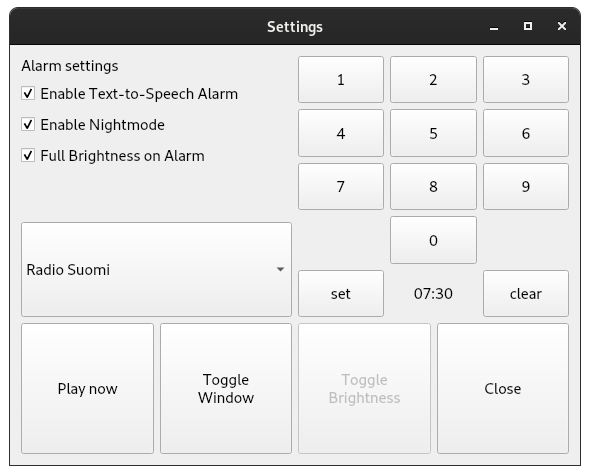

# Alarmpi

A Raspberry Pi clock radio with customizable Text To Speech alarm.
```
Good afternoon, it's Wednesday September twelfth. The time is 07:29 PM.

Weather for today is Mostly Cloudy becoming rainy. It is currently 16 degrees  with a fresh breeze. The high for today is 17 and the low at 11 degrees. The sun rises at 06:43 AM and sets at 07:50 PM.

And now, The latest stories from the World section of the BBC News.

EU parliament votes to punish Hungary over 'breaches' of core values.
The European Parliament votes to punish Hungary for allegedly flouting EU values and the rule of law.

Hurricane Florence: Mass evacuation from 'storm of a lifetime'.
South Carolina authorities turn four motorways into one-way routes away from the coast.

Morocco bans forced marriage and sexual violence.
The new law criminalises sexual harassment and imposes tougher penalties on perpetrators.

Sri Lanka to ban Hindu animal sacrifice.
The ritual killing of animals such as goats could soon be outlawed at Sri Lanka's Hindu temples.


Thats all for now. Have a nice day.
```
[Play on SoundCloud](https://soundcloud.com/lajanki/pialarm_sample)


This is a fork of skiwithpete's alarmpi project: https://github.com/skiwithpete/alarmpi. After seeing it on [YouTube](https://youtu.be/julETnOLkaU), I thought it was neat and knew I wanted to use it to replace my old night table clock radio.


## Main Features
 * Alarm scheduling
 * A spoken greeting based on time of day
 * Reads the day's weather from openweathermap.org
 * Reads latest news from BBC World RSS feed
 * Plays internet radio streams
 






## Hardware setup
This project is built around the following hardware.
 * Raspberry Pi
 * Official Raspberry Pi Display
 * A speaker

Apart from the speaker these aren't requirements per se. The project is mostly a couple of Python scripts which will likely run on many Linux platforms. The GUI does have two bindings to a Raspberry Pi: the buttons for toggling screen brightness and putting it to sleep are disabled on a different system.

It's also possible to run the alarm without the GUI on a headless setup, see Usage below.


## Setup
First, install required system packages with  
```apt install python-all-dev qt5-default ffmpeg festival mplayer portaudio19-dev```  
These include the Qt 5 development package, Festival text-to-speech engine, the command line media player mplayer and audio libraries enabling playback of mp3 files directly in Python.

Next, install Python packages with  
```pip install -r requirements.txt```  
Using a virtual environment is recommended

The GUI has Raspberry Pi specific buttons for manipulating the display's backlight brightness. In order to enable these two system files need to be made accessable by the session user (by default `pi`):
```
chown pi /sys/class/backlight/rpi_backlight/brightness
chown pi /sys/class/backlight/rpi_backlight/bl_power
```
This step can be ignored on other systems.


## Usage
Run the script either with
```
python main.py [configuration_file]
```
or
```
python play_alarm.py [configuration_file]
```
where `[configuration_file]` is an optional alarm configuration file either in `./configs/` or `$HOME/.alarmpi/`, ie.
```
python main.py default.conf
```
If no argument is used, `./configs/default.conf` will be used.


The first runs a GUI version of the script. It includes a digital clock interface for current time as well a settings window for setting the alarm. On a Raspberry Pi the GUI can also be used to toggle screen brightness between high and low as well as turning it to sleep entirely. These buttons will be disabled if the system files `/sys/class/backlight/rpi_backlight/brightness` and `/sys/class/backlight/rpi_backlight/bl_power` ether do not exist or are not writable.

The second form generates an alarm based on the configuration file and plays it. This can be used as a purely CLI interface for the alarm. Use cron to manually schedule an alarm.

If the radio stream is enabled as part of the alarm it will be played in a separate process using `mplayer` command line media player. When used as CLI alarm, the included `stop.sh` shell script can be used to terminate the stream.

When used from the GUI, the alarm works as a toggle. Once the alarm triggers, it will be deactivated and needs to be re-enabled in order to trigger again the next morning. Previous alarm time, however, is saved and need not be reset every time. 

The optional argument in both forms is a path to a configuration file for customizing the alarm, see [configs/README.md](./configs/README.md) for instructions. By default `configs/default.conf` will be used.


The full interface to `main.py` is:
```
Run alarmpi GUI

positional arguments:
  config        path to an alarm configuration file. Defaults to default.conf

optional arguments:
  -h, --help    show this help message and exit
  --fullscreen  launch the script in fullscreen mode
  --debug       launch in debug mode
```

## Unit tests
Unit tests can be run from the root folder with
```
python -m pytest tests
```
